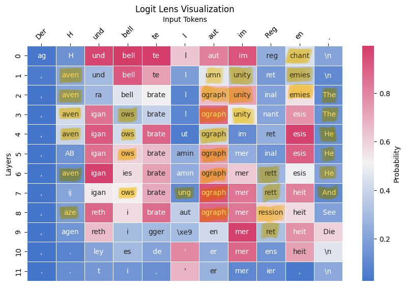

# Post-Hoc Analyse eines Large Language Model (LLM) mit Logit Lens

Ziel dieser Arbeit ist es, ein Large Language Model (LLM) zu analysieren. Hierfür wird ein Logit Lens verwendet, um die Entscheidungen des Modells zu visualisieren und zu interpretieren. Hierfür werden zwei Large Language Models verwendet: OpenAI's GPT-2 und Phi 1.5 von Microsoft.

Beide Modelle werden mit verschiedensten Prompts getestet um Schlüsse über die Traningdaten und die Funktionsweise des Modells zu ziehen.

## 1. Installation

### 1.1. Clonen des Repositories

Zuerst muss das Repository geklont werden. Hierfür kann folgender Befehl verwendet werden:

```bash
git clone https://github.com/KaganDemirer/XAI.git
```

### 1.2. Installation der benötigten Bibliotheken

Um den geschriebenen Code auszuführen muss Python installiert sein.<br>
Getestet wurde mit 3.9.6.<br>
Höhere Python Versionen wurden nicht getestet und könnten zu Fehlern führen.

Zuerst müssen die benötigten Python Bibliotheken installiert werden. Hierfür kann die `requirements.txt` Datei verwendet werden.

```bash
pip install -r requirements.txt
```


## 2. Anwendung

Anschließend können die Jupyter Notebooks ausgeführt werden. Vor der Ausführung kann im Jupyter Notebook über die Variable 'prompt' der Text, der analysiert werden soll, geändert werden.

## 3. Beispiel

Im folgenden Beispiel wird das Modell Phi 1.5 von Microsoft mit dem Prompt "The Eiffel Tower is in the city of" getestet.


In der Abbildung sind die Ergebnisse des Modells dargestellt. Die Wörter sind in verschiedenen Farben dargestellt, um die Entscheidungen des Modells zu visualisieren.

Jede Spalte in der Abbildung repräsentiert ein Token, das das Modell vorhersagt. Die Wörter sind in der Reihenfolge dargestellt, in der sie vom Modell vorhergesagt werden.
In die Vorhersage fließen jeweils immer die vorherigen Tokens ein.

Die Farben repräsentieren die Wahrscheinlichkeit, mit der das Modell das Wort als nächstes vorhersagt. Die jeweiligen Wahrscheinlichtkeiten sind aus der Legende am rechten Rand der Abbildung abzulesen.

In diesem Beispiel ist zu erkennen, dass das Modell mit hoher Wahrscheinlichkeit "Paris" als nächsten Token auf den letzten Token vorhersagt. Dies ist ein Hinweis darauf, dass das Modell die Eingabe "The Eiffel Tower is in the city of" mit "Paris" vervollständigt.

Aus solchen Erkenntnissen wie in diesem Beispiel lassen sich Schlüsse auf die Trainingsdaten und die Funktionsweise des Modells ziehen.


## 4. Bekannte Probleme

Es gab Schwierigkeiten bei der Implementierung von Modellen. In einigen Fällen war eine Berechtigung erforderlich. Andere Modelle waren aufgrund ihres Speicherplatzbedarfs zu groß. Wiederum andere Modelle lieferten am Ende keine zufriedenstellenden Ergebnisse und waren daher nicht auswertbar. Folglich wurde die Auswahl der Modelle auf zwei beschränkt.

Ein weiteres, noch nicht behobenes Problem tritt bei der Verwendung von Phi 1.5 auf. 
In einigen Fällen gelingt es nicht die benötigten Daten aus dem meta tensor zu extrahieren. Dies führt dazu, dass das Skript an dieser Stelle abbricht. Zum aktuellen Zeitpunkt ist für uns noch nicht klar, wie dieser Fehler behoben werden kann.

Da dieser Fehler allerdings nicht immer auftritt, kann es sein, dass das Skript bei erneutem Ausführen ohne Probleme durchläuft.
Andernfalls empfehlen wir die einzelne Zelle alleine auszuführen, da dies in der Vergangenheit öfters das Problem gelöst hat.

## 5. Fortschritt des Projekts
Der folgende Abschnitt beschreibt den fortlaufenden Prozess des Projekts. Dabei wird auch auf die einzelnen Implementierungen eingegangen sowie auf die Probleme, die während der Implementierung aufgetreten sind.

## 5.1. Implementierung

Inhalt dieses Projekts ist die Implementierung von zwei verschiedenen Large Language Models (LLM) und die Analyse der Modelle mithilfe eines Logit Lens. Hierfür wurden zwei Modelle ausgewählt: GPT-2 von OpenAI und Phi 1.5 von Microsoft.

### 5.1.1. Implementierung von GPT-2

Zuerst wurde das Modell GPT-2 von OpenAI implementiert. Aufgrund der weitreichenden Verbreitung und gut dokumentierter Implementierungen war die Implementierung des Modells relativ einfach. Die Implementierung des Modells erfolgte in einem Jupyter Notebook, in dem die Funktionsweise des Modells getestet wurde.

<a href="gpt2.ipynb">Hier geht's zum GPT-2 Notebook</a>

### 5.1.2. Implementierung von Phi 1.5

Zum Vergleich musste ein weiteres Modell implementiert werden. Abschließend wurde sich für das Modell Phi 1.5 von Microsoft entschieden. Ausschlaggebend für die Wahl des Modells waren vorangegangene Probleme mit anderen Modellen und viel Trial and Error.

So sind beispielsweise Implementierungen von BERT und Facebook OPT-125m gescheitert. Dies lag an verschiedenen Problemem wie etwa fehlerhaften Tokenizern. Letztendlich war Phi 1.5 das erste Modell, das erfolgreich als zweites implementiert werden konnte.

Die Implementierung von Phi 1.5 erfolgte ebenfalls in einem Jupyter Notebook. Auch hier wurde die Funktionsweise des Modells getestet.

<a href="phi1.5.ipynb">Hier geht's zum Phi 1.5 Notebook</a>

Im Bezug auf das Projektziel, die Analyse der Modelle mithilfe eines Logit Lens, war die Implementierung von Phi 1.5 ein wichtiger Schritt. Durch die Implementierung von zwei verschiedenen Modellen konnten die Modelle miteinander verglichen werden, jedoch hat dieser Schritt aufgrund der vielen Probleme und des Trial and Error Prozesses viel Zeit in Anspruch genommen, welche uns für eine genauere Analyse der Modelle fehlte.

## 5.2. Analyse

Ziel des Projekts war es, wie bereits beschrieben die Modelle mithilfe eines Logit Lens zu analysieren. Hierfür wurden verschiedene Prompts getestet, um die Entscheidungen der Modelle zu visualisieren und zu interpretieren.
Dabei wurde versucht Schlüsse auf die Traningsdaten des jeiligen Modells zu ziehen oder bereits bekannte Trainingsdaten anhand der Entscheidungen des Modells zu bestätigen.

Dazu wurden die Trainingsdaten beziehungsweise die Aussagen zu den Trainingsdaten analysiert und ausgehend davon zu bestätigende Thesen aufgestellt. Anschließend wurden die Modelle mit verschiedenen Prompts getestet, um die Thesen zu bestätigen oder zu widerlegen.

### 5.2.1. Analyse von GPT-2

#### Aussagen zu den Trainingsdaten
- GPT-2 wurde auf einem Datensatz von 8 Millionen Webseiten trainiert. --> Großteil auf Englisch
- GPT-2 wurde mit "predictive text" trainiert. --> Vorhersage des nächsten Wortes
- GPT-2 wurde ohne thematische Einschränkung trainiert. --> Allgemeinwissen

Diese Aussagen sollten mithilfe von Logit Lens überprüft werden.
Bei Aussage 1 wurde bestätigt, dass GPT-2 auf Englisch trainiert wurde. Bei Aussage 2 wurde bestätigt, dass GPT-2 das nächste Wort vorhersagt. Bei Aussage 3 wurde bestätigt, dass GPT-2 ohne thematische Einschränkung trainiert wurde.

Die Analyse erfolgt mit verschiedensten Prompts, um die Aussagen zu bestätigen oder zu widerlegen.
Bei der ersten Aussage wurde beispielsweise ein Prompt auf einer anderen Sprache als Ennglisch verwendet und es wurde analysiert, wie viele Layer einen Token vorhersagen, der auf Englisch ist.
Dabei viel auf, dass einige Layer an manchen Stellen ein englisches Wort vorhersagen, obwohl der Prompt auf einer anderen Sprache ist. Bei Prompts auf Englisch wurde jedoch meist kein fremdspracher Token vorhergesagt. Zum besseren Verständnis zeigt die folgende Abbildung nochmals einen Ausschnitt aus der Analyse zur ersten Aussage.



In dieser Abbildung sind alle Tokens gelb markiert, die ein englisches Wort bilden, obwohl der eigentliche Prompt auf deutsch ist.

Betrachtet man einen Prompt auf Englisch, fällt auf, dass (fast) keine Tokens vorhergesagt werden, die ein nicht englisches Wort bilden. Dies lässt sich in der folgenden Abbildung nochmals nachvollziehen, vor allem verglichen mit der vorherigen Abbildung.


Der gleiche Test lässt sich ebenfalls bei Phi 1_5 durchführen.
Und erzielt dabei ein ähnliches Ergebnis.

Des weiteren viel bei den Tests beispielsweise auf, dass GPT-2 anscheinend mit größtenteils Temperatur-Daten oder -Bezeichnungen der Celcius-Skala trainiert wurde.
Entsprechende Visualisierungen zu dieser Annahme finden sich im Repository im results Ordner.

Die anderen Aussagen wurden ebenfalls mithilfe von Prompts analysiert und bestätigt. Diese und weitere Analysen lassen sich im Notebook zu GPT-2 nochmals durchführen.
Einige Ergebnisse des Tests sind im Repository abgespeichert.


### 5.2.2. Analyse von Phi 1.5

#### Aussagen zu den Trainingsdaten
- Phi 1.5 wurde mit den selben Daten wie Phi 1 trainiert. --> Fokus auf Programmierung
- Common Crawl wurde aus dem Training entfernt. --> Kein verletzender Inhalt/verletzender Inhalt wurde reduziert

Die Analyse von Phi 1_5 konnte aufgrund der bereits beschriebenen Probleme nur eingeschränkt und nicht in gleichem Umfang wie bei GPT-2 durchgeführt werden. Dennoch konnten einige Aussagen überprüft werden.

Auch hierzu finden sich einige Ergebnisse aus den Tests im Repository.


## 5.3. Zusätzliche Analyse

Ergänzend zur Implementierung und Analyse der Modelle mit Logit Lens wurde ein Tensorboard für beide Modelle erstellt. Dieses Tensorboard zeigt die Word Embeddings der Modelle und ermöglicht eine weitere Analyse der Modelle.

Aufgrund des begrenzten Umfangs und der begrenzten Zeit konnten wir leider keine Analyse mithilfe des Tensorboards durchführen. Dennoch ist das Tensorboard eine nützliche Ergänzung zur Analyse der Modelle und im Repository verfügbar.

<a href="tensorboard_gpt2.ipynb">Hier geht's zum GPT-2 Tensorboard</a>

<a href="tensorboard_phi1_5.ipynb">Hier geht's zum Phi 1.5 Tensorboard</a>

## 6. Quellen

- https://medium.com/@TaaniyaArora/visualizing-gpt2-word-embeddings-on-tensorboard-ea5c8fef9efa

- https://nnsight.net/notebooks/tutorials/logit_lens/

- <a href="https://arxiv.org/abs/2309.05463">Li, Y., Bubeck, S., Eldan, R., Del Giorno, A., Gunasekar, S., & Lee, Y. T. (2023). Textbooks are all you need II: phi-1.5 technical report. arXiv preprint arXiv:2309.05463.</a>

- https://huggingface.co/microsoft/phi-1.5

- <a href="https://cdn.openai.com/better-language-models/language_models_are_unsupervised_multitask_learners.pdf">Radford, Alec, Jeff Wu, Rewon Child, David Luan, Dario Amodei and Ilya Sutskever. “Language Models are Unsupervised Multitask Learners.” (2019).</a>

- https://huggingface.co/openai-community/gpt2

- https://huggingface.co/transformers/v2.11.0/model_doc/gpt2.html

- https://medium.com/@TaaniyaArora/visualizing-gpt2-word-embeddings-on-tensorboard-ea5c8fef9efa


## 6. Kontakt

Bei Fragen oder Anregungen können Sie sich gerne an uns wenden.


### Kagan Demirer


Mail: privat@kagandemirer.de

[GitHub Profile](https://github.com/KaganDemirer)

### Claudius Laur


Mail: privat@claudiuslaur.de

[GitHub Profile](https://github.com/DrmedAllel)


<style>
.profile-picture {
    border-radius: 50%;
    width: 75px;
}
</style>